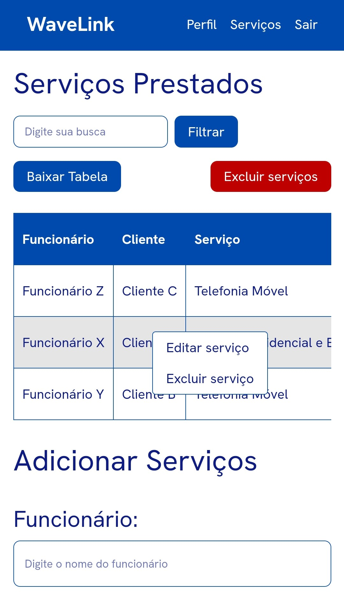
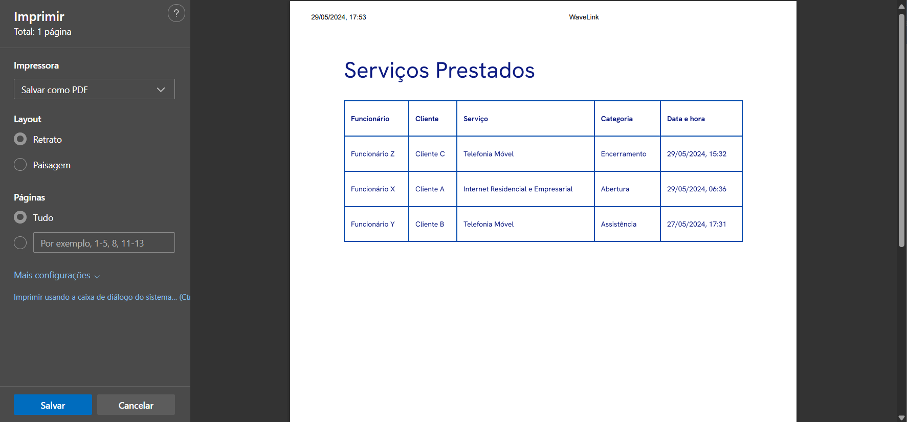
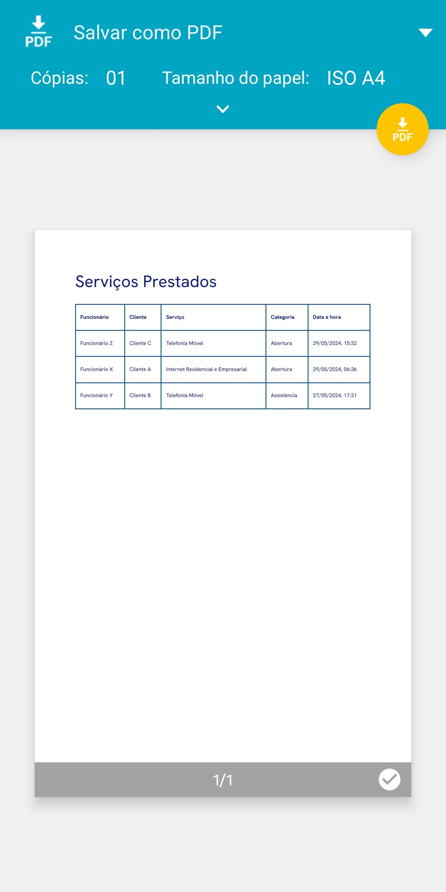
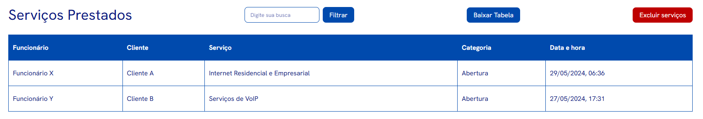
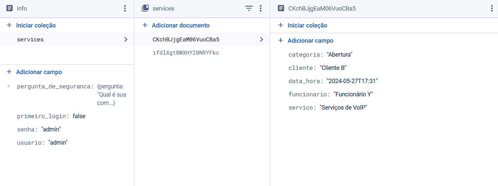

# Projeto Wavelink

Clique [aqui](https://waveproject.vercel.app/login) para acessar.

## Objetivo do Projeto
O sistema desenvolvido possui como finalidade o gerenciamento de serviços realizados por funcionários da empresa. Através desse projeto, a companhia averigua, em detalhes, os trabalhos executados pelos seus empregados, exibindo as informações de maneira centralizada.

## Ambiente de Desenvolvimento
Antes de apresentar o funcionamento geral do sistema elaborado, faz-se necessário evidenciar alguns aspectos considerados durante a etapa de produção do sistema.

O software utilizado para a elaboração do código do sistema foi o Visual Studio Code, acompanhado da extensão Prettier. Devido ao fato do código ser produzido por diferentes pessoas, surge a necessidade de padronização e formatação da escrita para obter uma estética uniforme, transtorno solucionado pela extensão supracitada. 

Outra extensão utilizada foi o Live Server para verificar, em tempo real, as atualizações feitas nos arquivos diretamente pelo navegador. Além disso, o GitHub foi a plataforma usada para o gerenciamento de versões e a hospedagem do sistema foi feita através do Vercel.

## Apresentação e Funcionamento do Sistema
Ao todo, o projeto possui 6 páginas:

1. Login

    

Por padrão, o nome de usuário e senha são definidos como “admin”. 

2. Definição de pergunta de segurança

    

Para realizar a recuperação de senha, foi adotado o mecanismo da pergunta de segurança. Após o primeiro login no sistema, será necessário escolher uma pergunta de segurança e definir uma resposta. Essa pergunta voltará a aparecer caso o usuário clique em “Esqueceu a senha?” na página de login.

3. Recuperação de senha 1

    

No caso acima, a pergunta de segurança escolhida foi “Qual é sua comida favorita?”. No entanto, a pergunta que irá ser exibida depende da escolha do usuário.

4. Recuperação de senha 2

    

Aqui, o usuário poderá completar o processo para realizar a troca de senha, digitando a sua nova senha duas vezes.

5. Página principal

    

A página principal exibe a tabela de dados e o bloco para adicionar serviços. Para editar algum serviço que já foi lançado na tabela, basta ir até a linha e clicar com o botão direito do mouse (caso esteja utilizando um computador) e selecionar “Editar Serviço”. 

    

Depois, os dados da linha que será editada aparecerão nos campos do bloco “Adicionar serviço” que, apenas durante esse momento de edição, irá ser denominado como “Editar serviço”. Com isso, o usuário poderá mudar os dados e clicar no botão “Editar” ou pressionar a tecla Esc para cancelar a ação. 

    

Caso a ação seja feita em um celular, o usuário deverá clicar duas vezes na linha que deseja editar para o menu flutuante aparecer. Para cancelar a ação, basta tocar no botão de voltar do celular.

    

Para excluir a linha da tabela, basta selecionar a opção “Excluir serviço”, seja no celular ou no computador. Se o usuário desejar excluir todos os serviços adicionados na tabela, é necessário clicar no botão vermelho “Excluir serviços” presente no topo da tabela. Se desejar salvar os serviços no armazenamento local, o usuário deverá clicar no botão “Baixar Tabela” para uma nova janela abrir.

    

No menu esquerdo, o usuário precisará localizar o campo “Impressora”, selecionar a opção “Salvar como PDF” e depois clicar em Salvar para o arquivo ser baixado. No celular, o processo é semelhante. Após tocar no botão para baixar a tabela, o usuário será redirecionado para uma outra janela na qual poderá salvar os dados localmente.

    

6. Perfil do usuário

    

Caso necessite, o usuário poderá trocar o seu nome de usuário ou a sua senha enquanto está dentro da sua conta no sistema.

## Diretórios do Projeto
A estrutura de diretórios do projeto foi elaborada de maneira que permita a facilidade de navegação entre os arquivos e também pensando em futuras alterações, como escalabilidade ou eventuais manutenções.

Cada pasta do projeto é representada por “/nome_da_pasta”. Os textos com fundo azul escuro são referências para as pastas, enquanto textos com fundo azul claro são para arquivos. Os arquivos presentes no projeto possuem as extensões HTML, CSS, JS, ICO e MD.

<ul>
    <li>HTML: São arquivos que armazenam a estrutura básica do sistema.</li>
    <li>CSS: Arquivos que armazenam as configurações visuais aplicadas no sistema.</li>
    <li>JS: São arquivos responsáveis por trazer um comportamento dinâmico/interativo ao projeto.</li>
    <li>ICO: Formato de arquivo utilizado para ícones que se adaptam a diferentes resoluções da tela e contextos de uso.</li>
    <li>MD: Arquivo de texto simples com uma sintaxe de formatação básica.</li>
</ul>

    

<ul>
    <li>/waveproject – É o diretório raiz do projeto, nele está contido todos os arquivos e pastas fundamentais para o funcionamento ideal do sistema.</li>
    <li>README.md – Fornece uma breve sinopse sobre o que se trata o projeto.</li>
    <li>prettierrc – Arquivo de configuração da extensão Prettier.</li>
    <li>/assets – Pasta que armazena todas as imagens utilizadas no arquivo README.md.</li>
    <li>/src – Armazena todos os códigos fonte do sistema.
        <ul>
            <li>/css – Acumula todos os arquivos CSS necessários para o funcionamento do projeto.</li>
            <li>/editar-perfil – Pasta que armazena o arquivo HTML da página de editar perfil.</li>
            <li>/login – Contém o arquivo HTML da página de login.</li>
            <li>/pergunta-seguranca – Armazena o arquivo HTML da página de pergunta de segurança.</li>
            <li>/redefinir-senha – Pasta que contém os arquivos HTML das páginas relacionadas à redefinição da senha do usuário.</li>
            <li>/js – Concentra todos os arquivos JavaScript necessários para o funcionamento do projeto.
                <ul>
                    <li>/api – Pasta que acumula os arquivos JavaScript referentes às funcionalidades do Cloud Firestore que estão sendo utilizadas no projeto.</li>
                    <li>/lib – Pasta que armazena o arquivo JavaScript que inicializa o Cloud Firestore, serviço do Google Firebase necessário para armazenamento dos dados do usuário.</li>
                </ul>
            </li>
            <li>favicon.ico – Ícone utilizado na guia do navegador.</li>
            <li>index.html – Arquivo referente à página principal do projeto.</li>
        </ul>
    </li>
</ul>

## Script de segurança
Dentre os arquivos do projeto, existe um script denominado “checa-login” que objetiva verificar se o usuário está autenticado no sistema. Em caso negativo, ele será redirecionado para a página de login para realizar o seu acesso. Esse script foi incluído no sistema pensando no quesito da segurança, para que apenas o administrador tenha acesso às informações contidas dentro dele.

## Armazenamento dos Dados
Para o armazenamento dos dados, o Cloud Firestore, um serviço oferecido pelo Google Firebase de forma gratuita, foi implementado ao projeto. O Cloud Firestore é um banco de dados flexível e escalonável que armazena e sincroniza todas as informações inseridas em tempo real.

A organização dos dados no Cloud Firestore é por meio de documentos, organizados em coleções. Os documentos podem armazenar subcoleções ou campos que recebem valores. Fazendo uma analogia, seria algo como uma pergunta (que são os campos) e uma resposta (que são os valores) armazenados em documentos, que, por sua vez, ficam em pastas (que são as coleções).

    

Na estruturação do banco de dados criado para o projeto, temos:

### *Admin* (Coleção) > *Info* (Documento) > *Services* (Subcoleção) ou campos.

A coleção *Admin* representa o usuário administrador do sistema. Como haverá apenas uma pessoa que irá acessar o sistema, sempre existirá apenas um usuário. A coleção *Admin* armazena o documento *info*. No documento *info*, teremos alguns campos que armazenam informações relacionadas ao login e uma subcoleção chamada *services* que armazena os serviços adicionados pelo usuário no sistema.

Quando o utilizador do sistema preencher os campos de dados e clicar no botão de adicionar serviço, as informações serão sincronizadas automaticamente com o banco de dados.

    

    

    

Devido à organização feita durante o desenvolvimento do código, a subcoleção *services* irá criar um documento individual com um nome aleatório para o serviço adicionado. Esse documento irá conter as informações adicionadas pelo usuário e distribuídas dentro dos campos com os nomes categoria, cliente, *data_hora*, *funcionario* e *servico*.