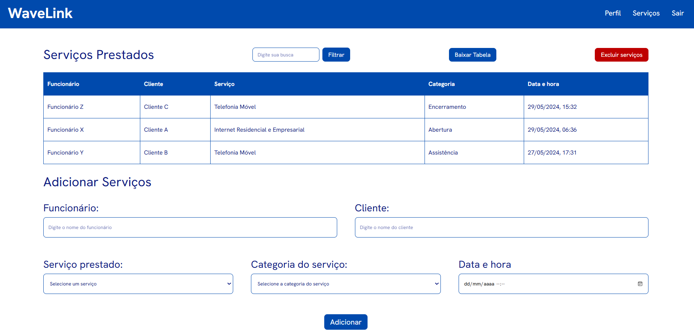

# Projeto Wavelink

Clique [aqui](https://waveproject.vercel.app/login) para acessar.

## Objetivo do Projeto
O sistema desenvolvido possui como finalidade o gerenciamento de serviços realizados por funcionários da empresa. Através desse projeto, a companhia averigua, em detalhes, os trabalhos executados pelos seus empregados, exibindo as informações de maneira centralizada.

## Ambiente de Desenvolvimento
<ul>
    <li>Software utilizado para elaboração do código: Visual Studio Code;</li>
    <li>Extensões utilizadas: Prettier e Live Server;</li>
    <li>Plataforma para gerenciamento de versões: GitHub;</li>
    <li>Plataforma para hospedagem do sistema: Vercel.</li>
</ul>

## Apresentação do Sistema
Ao todo, o projeto possui 6 páginas:

1. Login

    

 

2. Definição de pergunta de segurança

    

 

3. Recuperação de senha 1

    

 

4. Recuperação de senha 2

    

 

5. Página principal

    

 

A página principal exibe a tabela de dados e o bloco para adicionar serviços. Para editar algum serviço que já foi lançado na tabela, basta ir até a linha e clicar com o botão direito do mouse (caso esteja utilizando um computador) e selecionar “Editar Serviço”. 

 

    

 

Depois, os dados da linha que será editada aparecerão nos campos do bloco “Adicionar serviço” que, apenas durante esse momento de edição, irá ser denominado como “Editar serviço”. Com isso, o usuário poderá mudar os dados e clicar no botão “Editar” ou pressionar a tecla Esc para cancelar a ação. 

 

    

 

Caso a ação seja feita em um celular, o usuário deverá clicar duas vezes na linha que deseja editar para o menu flutuante aparecer. Para cancelar a ação, basta tocar no botão de voltar do celular.

Para excluir a linha da tabela, basta selecionar a opção “Excluir serviço”, seja no celular ou no computador. Se o usuário desejar excluir todos os serviços adicionados na tabela, é necessário clicar no botão “Excluir serviços” presente no topo da tabela.

 

6. Perfil do usuário

    

## Usuários do Sistema
O sistema possui dois perfis de usuário, sendo um para o administrador e outro para os funcionários. O administrador possui acesso a todas as funcionalidades do projeto descritas no tópico anterior. Por padrão, o nome de usuário e senha do perfil administrador são definidos como “admin”.

O perfil dos funcionários objetiva acessar a tabela para a visualização dos dados, apenas para observar os serviços lançados pelo administrador. Por conta disso, esse perfil não possui a possibilidade de alterar a senha, não possui uma página de perfil e também não possui permissão para adicionar ou editar serviços. Apenas a opção de baixar a tabela e pesquisar dados estarão disponíveis, conforme evidenciado na próxima imagem.

 

    

## Diretórios do Projeto
A estrutura de diretórios do projeto foi elaborada de maneira que permita a facilidade de navegação entre os arquivos e também pensando em futuras alterações, como escalabilidade ou eventuais manutenções. Cada pasta do projeto é representada por “/nome_da_pasta”. Os textos com fundo azul escuro são referências para as pastas, enquanto textos com fundo azul claro são para arquivos.

 

    

 

<ul>
    <li>/waveproject – É o diretório raiz do projeto, nele está contido todos os arquivos e pastas fundamentais para o funcionamento ideal do sistema.</li>
    <li>README.md – Fornece um detalhamento sobre o que se trata o projeto.</li>
    <li>prettierrc – Arquivo de configuração da extensão Prettier.</li>
    <li>/assets – Pasta que armazena todas as imagens utilizadas no arquivo README.md.</li>
    <li>/src – Armazena todos os códigos fonte do sistema.
        <ul>
            <li>/css – Acumula todos os arquivos CSS necessários para o funcionamento do projeto.</li>
            <li>/editar-perfil – Pasta que armazena o arquivo HTML da página de editar perfil.</li>
            <li>/login – Contém o arquivo HTML da página de login.</li>
            <li>/pergunta-seguranca – Armazena o arquivo HTML da página de pergunta de segurança.</li>
            <li>/redefinir-senha – Pasta que contém os arquivos HTML das páginas relacionadas à redefinição da senha do usuário.</li>
            <li>/js – Concentra todos os arquivos JavaScript necessários para o funcionamento do projeto.
                <ul>
                    <li>/api – Pasta que acumula os arquivos JavaScript referentes às funcionalidades do Cloud Firestore que estão sendo utilizadas no projeto.</li>
                    <li>/lib – Pasta que armazena o arquivo JavaScript que inicializa o Cloud Firestore, serviço do Google Firebase necessário para armazenamento dos dados do usuário.</li>
                </ul>
            </li>
            <li>favicon.ico – Ícone utilizado na guia do navegador.</li>
            <li>index.html – Arquivo referente à página principal do projeto.</li>
        </ul>
    </li>
</ul>

## Armazenamento dos Dados
Para o armazenamento dos dados, o Cloud Firestore, um serviço oferecido pelo Google Firebase de forma gratuita, foi implementado ao projeto. O Cloud Firestore é um banco de dados flexível e escalonável que armazena e sincroniza todas as informações inseridas em tempo real.

 

    

 

Na estruturação do banco de dados criado para o projeto, há duas coleções que representam os usuários cadastrados no sistema:

1. Primeira coleção

### *Admin* (Coleção) > *Info* (Documento) > *Services* (Subcoleção) ou campos

 

    

 

A primeira coleção representa o usuário administrador do sistema. Ela armazena o documento *info*, que contém alguns campos responsáveis por informações relacionadas ao login, além de uma subcoleção chamada *services* que armazena os serviços adicionados pelo administrador.

2. Segunda coleção

### *Employee* (Coleção) > *Info* (Documento) > Campos

 

    

 

A segunda coleção representa o perfil que os funcionários utilizarão para acessar o sistema. Como esse perfil foi criado para apenas permitir a visualização dos serviços lançados na tabela pelo administrador, sua estruturação no banco de dados é mais simples, armazenando apenas o nome de usuário e a senha do perfil.